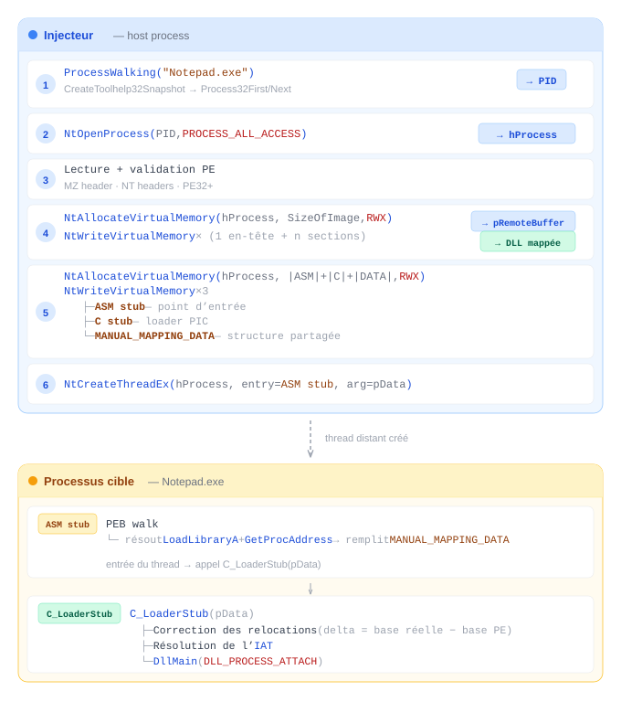

# Fully UnDetected (FUD) DLL Injector

- Lien VirusTotal: <LINK>
- Backup Archive.org: <LINK>
- Sha256sum: <SUM>

> [!abstract]
> Injecteur de DLL par **manual mapping** ciblant Windows x64, développé dans un cadre académique Red Team.
> L'objectif est d'injecter une DLL arbitraire dans un processus cible sans passer par l'API de Windows afin d'éviter la détection par les solutions AV/EDR courantes.

_Mots-clés : Mannual Mapping, Dynamic API Resolution, Direct Syscalls, PIC Shellcoding, Remote Process Injection_

## Contexte des missions Red Team

Dans le cadre d'une mission Red Team, disposer d'un injecteur de DLL indétectable est indispensable pour mêner assurer la _persistance_ de l'accès obtenu sur un système et procéder ultérieurement aux différents _pivots_.
En pratique, on injecte un _payload C2_, dît _Command and Control_, afin de réaliser des actions distantes sur la machine infectée depuis un serveur d'attaque.
On donne la représentation schématique suivante d'une telle attaque :



Ce faisant, un attaquant est à même d'opérer en toute discretion (si tant est que ses actions le soient) depuis une base (le client C2, la DLL injectée) subrepticement cachée au sein d'un processus anodin.
Tout l'enjeu réside ainsi dans l'obfuscation instillée au sein de l'injecteur afin de garantir de l'indétectabilité de l'injection.
Pour ce faire, plusieurs techniques sont mises en oeuvres afin de contourner les points de détection classiques tels que les API en userland de Windows, souvent hookées par les systèmes de détection, ou encore les analyseurs statiques tels Microsoft Defender ayant la capacité de reconnaître des schémas de codes malicieux.

## Decription détaillée des briques

Si la structure macroscopique est claire, un injecteur et une DLL injecté, le projet possède malgré des ramifications plus importantes qu'il n'y paraît.

> [!info] Intentions
> L'architecture se veut la plus modulaire possible, et le projet en tant que tel entend servir de librairie durable et réutilisable.
> Toutefois, celle-ci ne saurait être que pûrement pragmatique, car avant tout source d'un apprentissage des différents usages et différentes stratégies offensives à mettre en oeuvre dans un tel contexte.

### Architecture

Pour comprendre l'architecture du projet, il est nécessaire de revenir :

1. À l'itention du payload runner.
2. Aux contraites systémiques de Windows.

Dans un premier temps, il est nécessaire de déterminer le processus cible, afin d'agir en son sein.
Pour ce faire, l'injecteur a recours à des méthodes classiques telles que le _PEB Walk_ (implémenté en C d'abord), et le _Manual Mapping_.
Il est ainsi possible de _charger la DLL en mémoire_ -- ie. copier cette dernière au sein de la mémoire virtuelle du processus cible -- avant de lui donner le contrôle de l'exécution, et donc d'appeller `DllMain`.

Toutefois, pour rendre le programme nouvelle chargé en mémoire au sein du processus cible fonctionnel, il faut corriger manuellement un certain nombre de structure internes qui sont dépendantes de l'environnement d'exécution, c'est à dire du _processus_ lui-même.
Cette opération ne peut être réalisée simplement de l'extérieur ; et subséquemment, c'est un _**C Stub**_ compilé en _Position Independent Code_ (PIC) qui est chargé de la mise en fonctionnement de la DLL.
Cette étape intervient après la résolution des librairies locale au processus ciblé par un _**ASM Stub**_ implémentant le PEB Walk, et complétant une "structure partagée" stockée dans le même temps en mémoire que l'est écrite la DLL afin de communiquer des adresses nécessaires à la réalisation des appels à `GetProcAddress`.

```
Injecteur (host)                     Processus cible
─────────────────────────────────    ──────────────────────────────────────
1. PEB walk → résolution des API
2. Validation PE (MZ + NT + PE32+)
3. VirtualAllocEx + WriteProcess-    ← [DLL headers + sections]
   Memory                            ← [ASM stub | C stub | MANUAL_MAPPING_DATA]
4. CreateRemoteThread ──────────────→ ASM stub
                                          │ PEB walk → LoadLibraryA, GetProcAddress
                                          └→ C_LoaderStub(pData)
                                               ├ Relocations (delta patch)
                                               ├ Résolution IAT
                                               └ DllMain(DLL_PROCESS_ATTACH)
```

### Structure du projet

La structure du projet est la suivante :

```sh
.
├── src/
│   ├── main.c                    # Point d'entrée : init API, process walking, injection
│   ├── dll-injector.c            # Orchestration : manual mapping + injection des stubs
│   ├── pe-parser.c               # Validation et lecture du fichier PE
│   ├── loader-stub.c             # Stub C PIC (reloc + IAT + DllMain)
│   ├── asm-stub.nasm             # Stub ASM PIC (PEB walk dans le processus cible)
│   ├── simple-dll.c              # DLL de démonstration (notification systray)
│   └── utils/
│       ├── peb-lookup.c          # Résolution dynamique des API Win32 via PEB + hachage FNV-1a
│       ├── memory.c              # Wrappers mémoire : direct syscalls NT + fallback g_Api
│       ├── direct-syscalls.asm   # Stubs ASM : appels NT directs (NtOpenProcess, NtAllocateVirtualMemory…)
│       ├── log.c                 # Journalisation
│       └── stdio-sec.c           # Sécurisation des entrées/sorties standard
├── include/
│   ├── dll-injector/             # En-têtes principaux
│   ├── utils/                    # PEB lookup, macros, log, direct-syscalls, memory
│   └── windows/                  # Structures PE custom
├── docs/                         # Doxyfile + thème doxygen-awesome-css
├── test/                         # Tests unitaires (PE parser)
├── Makefile
└── deploy.sh                     # Build + copie vers le partage Windows
```

### Runner (`dll-injector.c`)

Le runner est le programme qui orchestre l'injection.
Il ne s'exécute pas dans le processus cible ; son rôle est de préparer, transporter et déclencher la charge utile depuis l'extérieur.

- **`ProcessWalking`** : Enumération des processus actifs via `CreateToolhelp32Snapshot` + `Process32First/Next`.
  Compare les noms d'exécutables jusqu'à trouver la cible et retourne son PID.

- **`MannualMappingDll`** : Ouvre un handle sur le processus cible, alloue `SizeOfImage` octets en mémoire distante (`PAGE_EXECUTE_READWRITE`), puis écrit les en-têtes PE et chaque section à son adresse virtuelle respective (`VirtualAddress`).
  La DLL est ainsi _mappée_ dans l'espace d'adressage cible, mais sans être chargée au sens de `LoadLibrary` : aucun module n'est référencé dans la `InLoadOrderModuleList`.

- **`injectManualMappingStub`** : Injecte le stub ASM, le stub C et la structure de données dans le processus cible, puis crée un thread distant pour déclencher l'exécution.

Après avoir écrit les trois éléments via `mem_write_process_memory` -- fonction n'étant qu'une interface pour le direct syscall `dWriteVirtualMemory` --, on crée le thread distant dont le point d'entrée est le début du stub ASM et l'argument (`rcx`) l'adresse distante de `MANUAL_MAPPING_DATA`.

> **Détail d'implémentation :** Le bytecode du stub ASM est inclus à la compilation sous forme de tableau via `asm-stub-bin.h` (généré par `xxd -i`).
> La taille du stub C est calculée par soustraction de symboles : `cStubSize = (BYTE*)C_LoaderStub_End − (BYTE*)C_LoaderStub`, ce qui suppose que les deux fonctions soient adjacentes dans le binaire final — garanti par leur isolation dans un objet compilé sans réordonnancement.

### ASM Stub (`asm-stub.nasm`)

Le stub ASM est un shellcode x64 _position-independent_ : il ne contient aucun import, aucune référence externe, et peut s'exécuter depuis n'importe quelle adresse du processus cible.
Il constitue le point d'entrée du thread distant.

Son rôle est de résoudre `LoadLibraryA` et `GetProcAddress` au sein du processus cible, sans aucune aide extérieure, puis de transmettre ces adresses au stub C via `MANUAL_MAPPING_DATA` et d'appeler ce dernier.

**Séquence d'exécution :**

1. **Alignement de pile** (`and rsp, -16`) — conformité à l'ABI Windows x64 avant tout `call`.
2. **Sauvegarde de `pData`** (`rcx` → `[rsp]`) — le pointeur vers `MANUAL_MAPPING_DATA` est conservé sur la pile, les registres volatils étant écrasés par les appels suivants.
3. **`get_ldr_head`** — lit `gs:[0x60]` (adresse du PEB dans le TEB), navigue vers `PEB_LDR_DATA` (`+0x18`), puis vers la tête de `InMemoryOrderModuleList` (`+0x20`).
4. **`walk_to_module_dllbase`** — parcourt la liste doublement chaînée des modules en comparant les noms WCHAR (offset `+0x50` dans l'entrée LDR) jusqu'à trouver `KERNEL32.DLL`. Retourne la `DllBase`.
5. **`get_export_ctx`** — valide la signature PE (`0x00004550`) et la présence d'un Export Directory (`DataDirectory[0].VirtualAddress ≠ 0`).
6. **`resolve_export_by_name`** — itère sur `AddressOfNames` (ASCII strcmp interne `_strcmp_ascii`), récupère l'ordinal dans `AddressOfNameOrdinals`, puis l'adresse finale dans `AddressOfFunctions`. Entièrement inline, sans appel système.
7. **Résolution de `GetModuleHandleA`, `GetProcAddress`, `LoadLibraryA`** dans l'EAT de Kernel32.
8. **Complétion de `MANUAL_MAPPING_DATA`** — écrit `pLoadLibraryA` et `pGetProcAddress` dans la structure partagée.
9. **Appel de `C_LoaderStub(pData)`** via `pData->pCStubAddress` (adresse distante fixée par le runner).
10. **`ExitThread(0)`** — résolu dynamiquement via `GetModuleHandleA`(`kernel32.dll`) + `GetProcAddress`, puis appelé pour terminer proprement le thread distant.

En cas d'erreur à n'importe quelle étape, le label `die` provoque un `int 3` suivi d'une écriture nulle sur `[0]` — segfault intentionnel pour éviter une exécution non contrôlée.

> **Contrainte PIC :** toutes les chaînes (nom WCHAR de Kernel32, noms ASCII des fonctions) sont stockées dans la section `.text` et adressées en `[rel ...]` (adressage relatif au RIP). Le stub ne déclare aucune section `.data`, aucune section `.rdata`.

### C Stub (`loader-stub.c`)

Le stub C est un _loader PIC_ compilé sans CRT (`-nostdlib`, pas de `_start`).
Il s'exécute dans le processus cible, là où le stub ASM lui passe la main via `pData->pCStubAddress(pData)`.
Son unique rôle est de rendre la DLL mappée fonctionnelle en trois étapes.

1. **Relocation de base :**

La DLL a été copiée à une adresse arbitraire (`pBaseAddress`) qui diffère généralement de son `ImageBase` préféré. Le stub calcule `delta = pBase − ImageBase` puis parcourt le répertoire `.reloc` (tableau de blocs `IMAGE_BASE_RELOCATION`). Pour chaque entrée de type `IMAGE_REL_BASED_DIR64` (type `0xA`, seul type pertinent en x64), il ajoute `delta` à l'adresse stockée à l'offset correspondant. Sans cette étape, tous les pointeurs absolus de la DLL seraient invalides.

2. **Résolution de l'IAT :**

Parcourt la table des imports (`IMAGE_IMPORT_DESCRIPTOR`).
Pour chaque DLL importée, appelle `LoadLibraryA` (fourni par pData). Pour chaque thunk :

- **Import par ordinal** (`IMAGE_SNAP_BY_ORDINAL`) → `GetProcAddress(hMod, MAKEINTRESOURCE(ordinal))`
- **Import par nom** → `GetProcAddress(hMod, pIBN->Name)`

L'adresse résolue est écrite dans `FirstThunk` (l'IAT effective).
Si `OriginalFirstThunk` est absent, `FirstThunk` sert à la fois de table de noms et de destination.

3. **Appel du `DllMain` :**

Appelle le point d'entrée de la DLL (`AddressOfEntryPoint`) avec `(HMODULE)pBase, DLL_PROCESS_ATTACH, NULL`.
C'est à partir de cet appel que le code utilisateur de la DLL s'exécute.

## Injection distante

### Étapes de l'injection

L'injection se déroule en six étapes séquentielles, dont les quatre dernières impliquent des opérations sur la mémoire du processus cible.



### API utilisées

Les opérations critiques sur la mémoire distante passent directement par la couche NT, sans transiter par les fonctions userland de `kernel32.dll`, usuellement hookées par les solutions de détection.

- **Direct syscalls (stubs ASM, `src/utils/direct-syscalls.asm`)[^1] :**

| Fonction NT               | Numéro de syscall | Rôle                                                |
| ------------------------- | :---------------: | --------------------------------------------------- |
| `NtOpenProcess`           |     `0x0026`      | Ouverture du handle sur le processus cible          |
| `NtAllocateVirtualMemory` |     `0x0018`      | Allocation de mémoire distante                      |
| `NtWriteVirtualMemory`    |     `0x003a`      | Écriture de la DLL et des stubs en mémoire distante |
| `NtReadVirtualMemory`     |     `0x003f`      | Lecture de la mémoire distante                      |
| `NtProtectVirtualMemory`  |     `0x0050`      | Modification des permissions mémoire                |
| `NtCreateThreadEx`        |     `0x00c9`      | Création du thread distant                          |

> [!WARNING] Stabilité des direct syscalls
> Étant donné que la version de Windows est connue, on se permet d'hardcoder les direct syscalls afin de gagner en complexité spatiale.
> En se documentant, on réalise qu'on peut déterminer le numéro des syscalls en parsant `ntdll.dll`
> Une autre méthode serait d'implémenter un `GenericSyscall` et de déterminer les syscalls ezn triant l'EAT à l'initialisation de la DLL en s'inspirant de la méthode FreshyCalls.[^2]

[^1]: <https://github.com/j00ru/windows-syscalls>

[^2]: <https://github.com/crummie5/FreshyCalls>

- **Fallback `g_Api` (résolution dynamique via PEB, pas d'équivalent NT direct) :**

| Fonction Win32                     | Rôle                                     |
| ---------------------------------- | ---------------------------------------- |
| `CreateToolhelp32Snapshot`         | Capture de la liste des processus actifs |
| `Process32First` / `Process32Next` | Itération sur les entrées du snapshot    |
| `VirtualFreeEx`                    | Libération de mémoire distante           |
| `CloseHandle`                      | Fermeture des handles                    |
| `GetLastError` / `FormatMessageA`  | Gestion et formatage des erreurs         |

> [!TIP]
> Il est à noter que toutes les interfaces de l'API Windows n'ont pas d'""équivalent direct syscall" immédiat.
> En l'occurrence, toutes les fonctions ne sont pas de simples wrappers, et réalisent parfois des pré-traitements essentiels.

### Erreurs possibles et mitigations

| Étape                      | Erreur                                                                      | Mitigation                                                                                               |
| -------------------------- | --------------------------------------------------------------------------- | -------------------------------------------------------------------------------------------------------- |
| `NtOpenProcess`            | `STATUS_ACCESS_DENIED` — processus protégé (PPL) ou privilèges insuffisants | Cibler un processus non-protégé s'exécutant dans le même contexte d'intégrité                            |
| `NtAllocateVirtualMemory`  | `STATUS_QUOTA_EXCEEDED` ou adresse de base refusée                          | Passer `NULL` comme adresse souhaitée pour déléguer le choix au noyau                                    |
| `NtWriteVirtualMemory`     | `STATUS_PARTIAL_COPY` — région cible non-accessible                         | S'assurer que la région a été allouée avec les droits adéquats (`PAGE_EXECUTE_READWRITE`) avant écriture |
| `NtCreateThreadEx`         | `STATUS_PROCESS_IS_TERMINATING` — processus en cours de fermeture           | Valider que le processus cible est actif avant la création du thread                                     |
| `CreateToolhelp32Snapshot` | `INVALID_HANDLE_VALUE` — snapshot impossible                                | Vérifier que le processus cible est bien en cours d'exécution                                            |

### Justification du processus cible

On choisit le processus `explorer.exe` comme processus cible, notamment car :

- il est détenu par l'utilisateur, et s'exécute avec les privilèges de ce dernier ;
- il est toujours et nativement présent, ce qui en fait un gage de stabilité ;

## Techniques mises en œuvre

| Technique                | Description                                                                                                                                                                       |
| ------------------------ | --------------------------------------------------------------------------------------------------------------------------------------------------------------------------------- |
| **Manual Mapping**       | Copie manuelle du PE en mémoire distante, sans `LoadLibrary`                                                                                                                      |
| **API Hashing (FNV-1a)** | Résolution des API Win32 au runtime via parcours du PEB — aucun import suspect dans l'IAT                                                                                         |
| **ASM stub PIC**         | Shellcode x64 position-independent : parcours du PEB dans le processus cible pour résoudre `LoadLibraryA` et `GetProcAddress`                                                     |
| **C Loader stub PIC**    | Stub compilé sans CRT : relocation de base, résolution de l'IAT, appel du `DllMain`                                                                                               |
| **Direct Syscalls (NT)** | Appels directs au noyau via l'instruction `syscall` x64, court-circuitant `ntdll.dll` et ses hooks userland (`NtOpenProcess`, `NtAllocateVirtualMemory`, `NtWriteVirtualMemory`…) |

## Pipeline de build

### Prérequis

- `x86_64-w64-mingw32-gcc` — cross-compilateur Linux → Windows
- `nasm` — assembleur pour le stub ASM
- `doxygen` — génération de la documentation (optionnel)

### Build

```bash
# Build release (défaut)
make

# Build debug
make MODE=debug

# Build + déploiement vers ~/windows_share
./deploy.sh

# Documentation
make docs        # génère docs/html/
make clean-docs  # supprime docs/html/ et docs/latex/
```

Les artefacts sont produits dans `build/` :

| Fichier            | Description             |
| ------------------ | ----------------------- |
| `dll-injector.exe` | L'injecteur             |
| `injected-dll.dll` | La DLL de démonstration |

### Utilisation

```cmd
dll-injector.exe <chemin_vers_la_dll>
```

Le processus cible est **Notepad.exe** (codé en dur à titre de démonstration). L'injecteur localise le premier processus correspondant, mappe la DLL par manual mapping et exécute le loader via un thread distant.

## Choix Techniques

### Pourquoi cette méthode d'injection ?

Le choix s'est porté sur une **Injection de Processus Distant par Manual Mapping**.
Contrairement à l'utilisation classique de `LoadLibrary`, le manual mapping consiste à réimplémenter le chargeur Windows (`Ldr`) en mode utilisateur pour copier manuellement les sections de la DLL dans l'espace mémoire de la cible.
Ce faisant, on évite :

- de faire appel à une fonction critique de l'API Windows, en ce qu'elle est centrale et criarde ;
- de recenser la DLL injectée.

### Avantages et Inconvénients

| Avantage                                                                                                  | Inconvénient                                                                                                             |
| --------------------------------------------------------------------------------------------------------- | ------------------------------------------------------------------------------------------------------------------------ |
| **Furtivité accrue** : La DLL n'apparaît pas dans la liste des modules chargés (`InLoadOrderModuleList`). | **Complexité** : Nécessite de gérer manuellement les relocalisations, l'Import Address Table (IAT) et les callbacks TLS. |
| **Bypass ETW** : Évite les événements système générés par `LoadLibrary`.                                  | **Stabilité** : Plus sensible aux variations de structures PE complexes.                                                 |

### Alternatives écartées

- **LoadLibrary (DLL Injection standard)** : Écartée car extrêmement surveillée par les EDR et facile à détecter via l'analyse des modules chargés.
- **Process Hollowing** : Écartée car le remplacement de l'image d'un processus légitime est aujourd'hui une signature comportementale forte pour la plupart des antivirus modernes.

## Stratégie FUD (Fully Undetectable)

### Actions entreprises pour réduire la détection

1. **Résolution Dynamique d'API (PEB Hashing)** : Suppression de la table des imports (IAT) de l'exécutable.
   Les fonctions nécessaires sont résolues à la volée en parcourant le _Process Environment Block_ et en comparant les hashs **FNV-1a** des noms de fonctions pour éviter les chaînes de caractères suspectes.
2. **Direct Syscalls (EAT Sorting)** : Pour les primitives d'injection (`NtAllocateVirtualMemory`, `NtWriteVirtualMemory`, etc.), nous utilisons des appels système directs.
3. **Anti-Sandbox** :
4. **Obfuscation Statique** :

### Résultats de tests

- **Tests Locaux** : Exécution réussie sur Windows 11 avec **Windows Defender** (Protection en temps réel activée). Aucune alerte déclenchée, payload opérationnel.
- **Services en ligne (VirusTotal)** :
- **Score :** [Insérer ton score, ex: 2/72]
- **Lien :** [Ton lien VT]
- **Archive.org :** [Lien vers la sauvegarde Archive.org]

## Limites Connues

### Ce qui reste détectable

- **Analyse de la Call Stack** : Un EDR peut détecter que l'exécution provient d'une région mémoire n'étant pas associée à un fichier sur le disque (mémoire "unbacked").
- **Scanner de mémoire (YARA)** : Si les chaînes de caractères du payload (DLL) sont déchiffrées en mémoire sans être nettoyées, elles peuvent être détectées par un scan périodique de la RAM.
- **Comportement (Behavioral)** : L'accès répété au presse-papiers par un processus injecté peut être considéré comme suspect sur une longue période.

### Points à améliorer pour un déploiement réel

- **Stack Spoofing** : Masquer l'origine de l'exécution dans la pile d'appels.
- **Polymorphisme** : Chiffrer le stub assembleur et les sections de l'injecteur pour changer sa signature à chaque exécution.
- **Module Overloading** : Au lieu d'allouer une nouvelle page mémoire, écraser un module légitime peu utilisé dans le processus cible pour y loger la DLL.

## Bibliographie

- **Maldev Academy** : Documentation sur le Manual Mapping et le PEB Walking.
- **Alice Climent-Pommeret (FreshyCalls)** : Concept du tri de l'Export Address Table pour la résolution de SSN.
- **Jackson_T (SysWhispers)** : Implémentation des stubs assembleur pour les syscalls directs.
- **Microsoft Technical Documentation** : Structures internes `ntdll.dll` et Native API.
- **Ired.team** : Evasion techniques et API Hashing.
